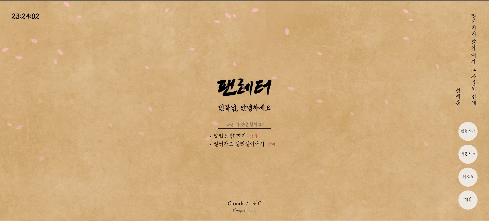
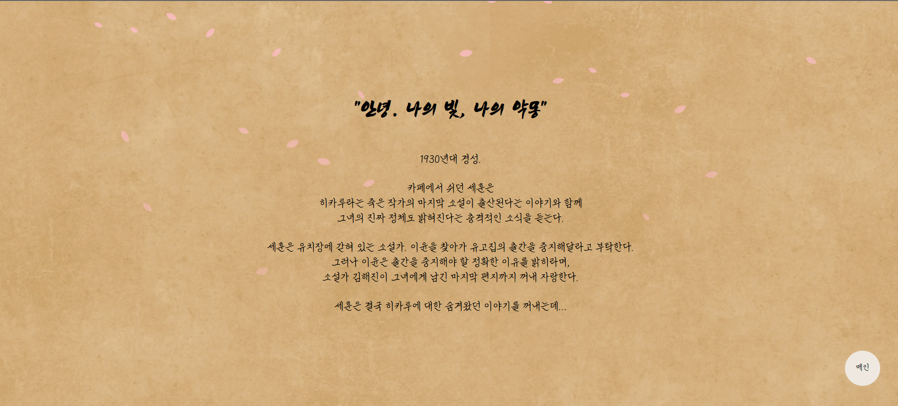
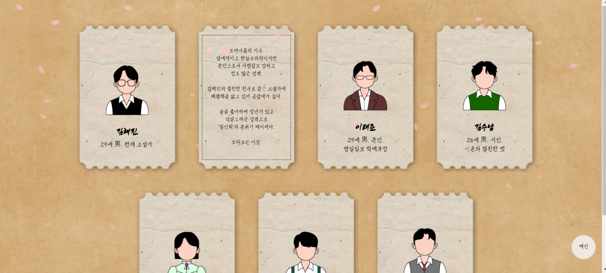
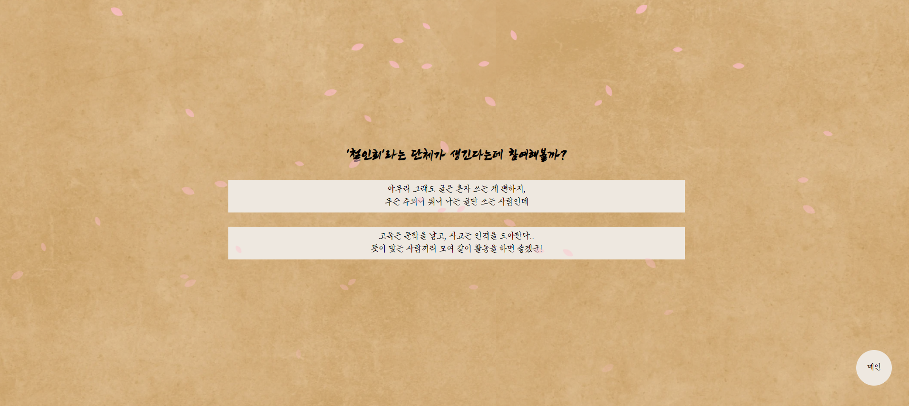
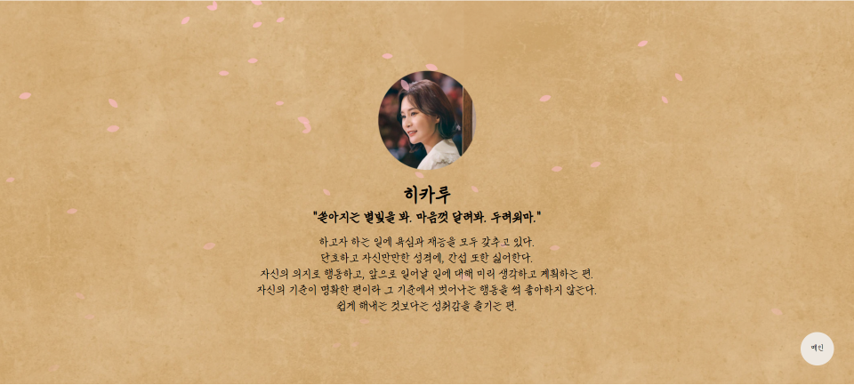

 
 
 
 

    

 
 
 
 
  
# 💌 팬레터 소개
 뮤지컬 팬레터 팬 페이지 입니다. 
 메인 페이지, 시놉시스, 인물 소개 그리고 테스트 페이지로 구성되어있습니다. 

 ## 메인 페이지
  
 

    

 
메인 페이지에서는 최초 1회 로그인이 필요합니다. 
한 번 로그인 한 후에는 사용자의 이름과 할 일 목록을 기억합니다. 
 
 

    

 
메인 페이지에서는 현재 시간, 로그인 기능, 할 일 목록, 명대사, 날씨 정보를 제공합니다. 
 
 

    

 
우측 하단에 위치한 버튼을 이용하여 다른 페이지로 이동하거나, 
메인 페이지로 돌아올 수 있습니다. 
버튼은 모든 페이지에서 사용이 가능합니다. 

 
 

### # 할 일 목록  
 
사용자는 할 일 목록을 추가하고 삭제할 수 있으며, 사용자가 추가한 할 일 목록은 로컬 스토리지에 저장되어 
창을 닫거나 컴퓨터를 종료해도 기억됩니다. 

### # 명대사 
 
우측 상단에서는 뮤지컬 팬레터의 인물별 명대사를 보여줍니다. 
명대사는 페이지가 새로고침될 때 마다 변경됩니다. 

### # 날씨 정보  
 
메인 페이지의 하단에서 날씨 정보를 확인할 수 있습니다. 
웹 페이지는 사용자의 현재 위치를 파악하고 위치에 따른 날씨 정보를 제공합니다. 

 
 

## 시놉시스
 

    

 
 시놉시스 페이지에서는 뮤지컬 펜레터에 대한 간략한 소개를 제공합니다.

 
 

## 인물 소개
 
 

    

 
인물 소개 페이지에서는 뮤지컬 펜레터에 등장하는 인물들에 대한 소개를 제공합니다. 
카드의 앞면에서는 인물의 이름과 나이, 성별, 직업을 알 수 있고, 
카드의 뒷면에서는 인물에 대한 상세한 정보를 알 수 있습니다. 

 
 

## 테스트
 테스트 페이지에서는 나와 닮은 등장 인물 찾기 테스트를 할 수 있습니다. 
 몇 가지 질문에 답하면, 답한 내용에 따라 테스트 결과를 얻을 수 있습니다. 

### # 질문 
 
 

    

### # 결과 
 
 

    

 
 
 

# ✏ Skills
HTML, CSS, JavaScript

 
 

# 🖥 Responsive
Desktop, Laptop, Tablet, Mobile

 
 

# 👀 Demo
https://minbok-1998.github.io/Fan-letter/

 
 
 
# ✨프로젝트 소개
개인프로젝트 입니다. 
기획, 디자인, 개발 -> 이혜영

 
 

# 📆 제작기간
2022년 01월 ~ 02월

 
 

# 🛠 추가 수정사항
- 2022.02.05 현재 이미지, 제이쿼리 관련 오류가 발생합니다.
- 2022.02.08 결과 페이지 중복 현상이 발생합니다.