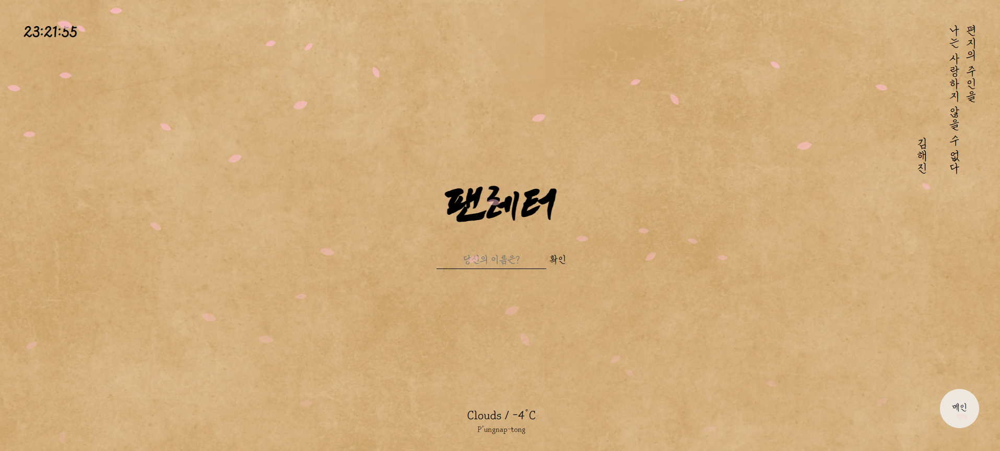
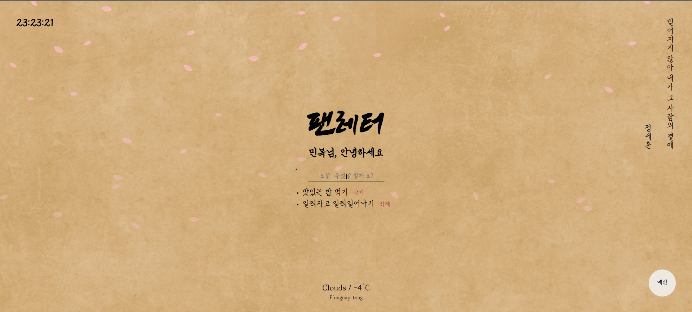

 
 
 
 

    

 
 
 
 
  
# 💌 팬레터 소개
 뮤지컬 팬레터 팬 페이지 입니다. 
 메인 페이지, 시놉시스, 인물 소개 그리고 테스트 페이지로 구성되어있습니다. 

 ## 메인 페이지
 

    

메인 페이지에서는 최초 1회 로그인이 필요합니다. 
한 번 로그인 한 후에는 사용자의 이름과 할 일 목록을 기억합니다. 

 

    

메인 페이지에서는 현재 시간, 로그인 기능, 할 일 목록, 명대사, 날씨 정보를 제공합니다. 

<b># 할 일 목록</b>  
사용자는 할 일 목록을 추가하고 삭제할 수 있으며, 사용자가 추가한 할 일 목록은 로컬 스토리지에 저장되어 
창을 닫거나 컴퓨터를 종료해도 기억됩니다. 

<b># 명대사</b> 
우측 상단에서는 뮤지컬 팬레터의 인물별 명대사를 보여줍니다. 
명대사는 페이지가 새로고침될 때 마다 변경됩니다. 

<b># 날씨 정보</b>  
메인 페이지의 하단에서 날씨 정보를 확인할 수 있습니다. 
웹 페이지는 사용자의 현재 위치를 파악하고 위치에 따른 날씨 정보를 제공합니다. 

 ## 시놉시스

 ## 인물 소개

 ## 테스트
 
 메인 페이지에서는 로그인, TO DO List, 현재 시간, 사용자의 위치에 따른 날씨 정보를 제공합니다. 
 시놉시스 페이지에서는 뮤지컬 펜레터에 대한 간단한 정보를 제공합니다. 
 인물 소개 페이지에서는 뮤지컬 펜레터에 등장인물에 대한 소개를 제공합니다. 
 테스트 페이지에서는 나와 닮은 뮤지컬 등장인물 찾기 테스트를 할 수 있습니다.
 
 
 

# 👀 Demo
https://minbok-1998.github.io/Fan-letter/

 
 
 
# ✨프로젝트 소개
개인프로젝트 입니다.

 
 

# 📆 제작기간
2022년 01월 ~ 02월

 
 

# 🛠 추가 수정사항
- 2022.02.05 현재 이미지, 제이쿼리 관련 오류가 발생합니다.
- 2022.02.08 결과 페이지 중복 현상이 발생합니다.